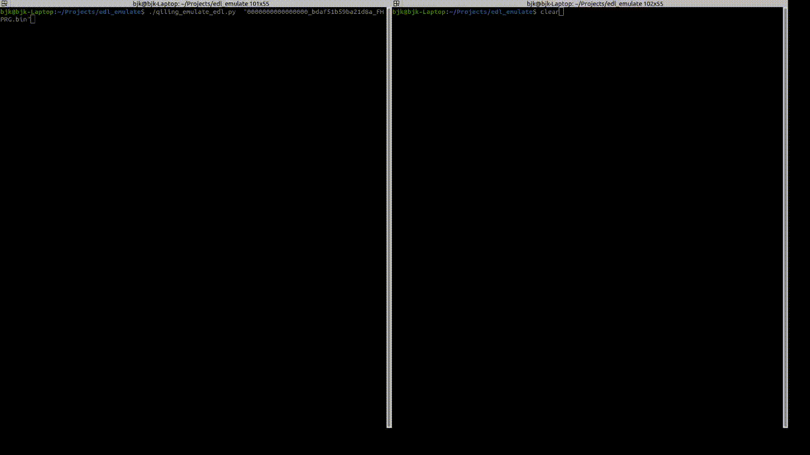

# edl_emulate

Emulate QC EDL via qiling, by B. Kerler 2020

## Installation

```bash
sudo apt install python3 python3-pip -y
pip3 install --user unicorn-engine
pip3 install --user https://github.com/qilingframework/qiling/archive/dev.zip
``` 

## Run

In one window (server)
```bash
./qiling_emulate_edl.py "0000000000000000_bdaf51b59ba21d8a_FHPRG.bin"
```

In another window (client)
```bash
./client.py
```



## Have fun !